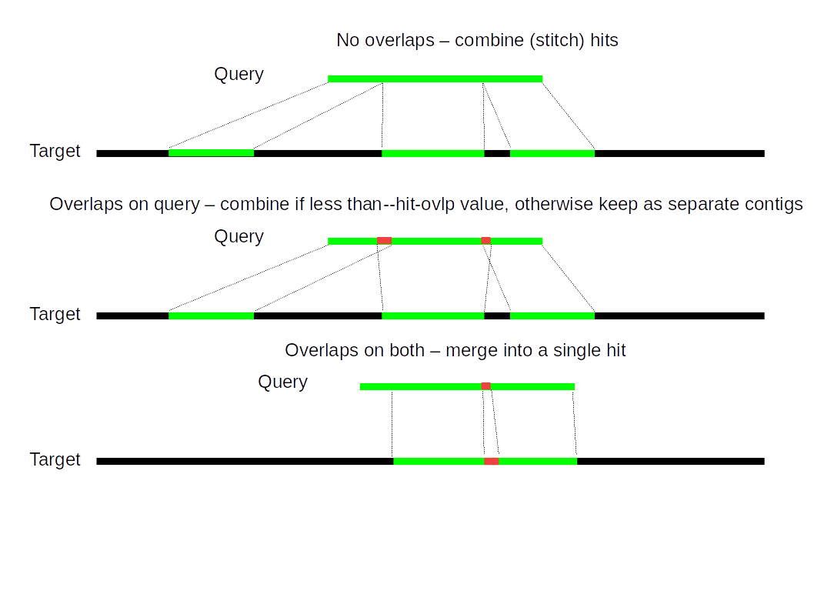
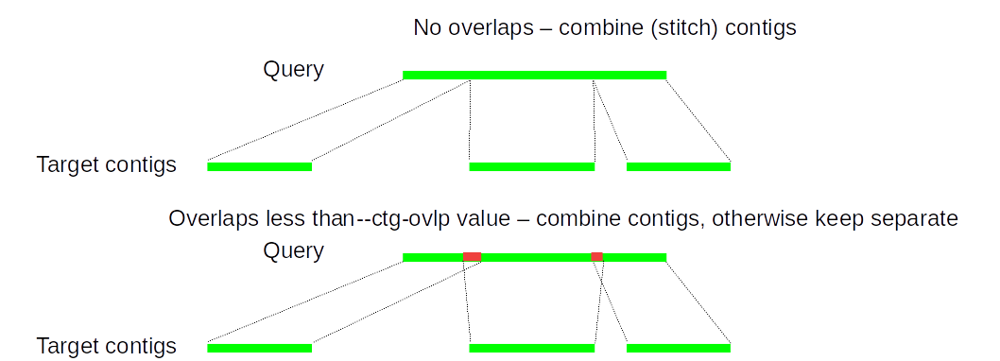
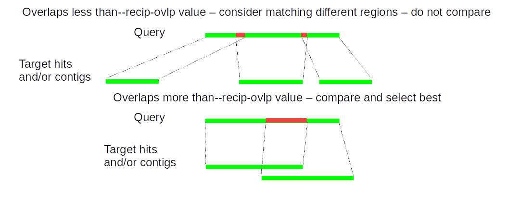

# ALiBaSeq
Alignment-Based Sequence extraction


## Description
The core of the software - `alibaseq.py` - is designed to retrieve homologous regions from a FASTA file with contigs (e.g., an NGS read assembly file). The retrieval is done based on reading BLAST or HMMER search tab-delimited output tables and then searching for the results in an assembly file. Software is designed to compile gene regions for phylogenetic inference (grouping all taxa being processed per locus and appending this data to given loci files), however this is not required and a different output structure can be selected. Optionally, a reverse search (reciprocal best hit check) table and a reference search (baits searched against a complete assembly / proteome of taxon they are derived from) table can be provided.
The following assumptions were used when developing the script:
* Technical
	- input (forward) search table has locus name or locus file name with extension in the query column and contig name in the target column
	- **in case of multiple samples processed at once**, input forward and reference search tables located in the same folder, and named exactly as assemblies apart from having the following extensions appended: `.blast` for BLAST and `.hmmer` for HMMER. Reciprocal search tables have suffix `_reciprocal.blast` appended to forward search table name. Assemblies have extension `.fasta`. See examples below.
	- if provided scripts are used for forward searches, bait files are to be organized one per locus in the same folder, with .fas extension
* Methodological
	- bait sequences can correspond to multiple hit regions in a given contig (a case of missing data or variable region in the bait, or intron presence in the target)
	- bait sequences can correspond to multiple contigs in the assembly (a case of low-coverage assembly with broken up gene sequences)
	- no sequence fragment order rearrangements are assumed (in case of multiple hits or multiple contigs they are arranged as in the bait)
	- bait pool can contain paralogs or otherwise similar sequences; each target by default is checked to match only one bait, and pairing is done based on forward search similarity score and optionally reciprocal best hit score; multiple targets may be paired with the same bait, but each target may only correspond to one bait (the check can be disabled).
	- paralogs can be located on the same contig in the assembly (since both contig name and coordinates are utilized to assign targets to queries, 'unused' regions of contigs can contribute to other loci)
	- nested genes can be extracted without disabling assembly contig 'usage check' if they share same general contig region but actual matching sequence regions are different (e.g., introns in one gene contain exons of another); alternatively a check for a given contig region to be used only once can be disabled, with all the consequences; both procedures require adjusting --lr option.


## Dependencies
Python 2.7, Biopython

## Installation
Clone the repository like this:
```
git clone https://github.com/AlexKnyshov/alibaseq.git
```

## Workflow
### Basic extraction
Requirements:
- bait sequences in files, one file per locus (can contain multiple sequences)
- target files (typically, assembled contigs) in fasta format
- list of file names of target files (in case there is more than one target)

#### Search
Seach using tblastx:
```
bash blast_wrapper.sh ./query_folder/ ./assembly_folder/ 1e-05 tblastx 4 n ./list_of_files_to_seach_against.txt
```
After search is complete, the output (.blast) files can be placed in a separate folder
```
mkdir blast_results
mv *.blast blast_results
```
#### Sequence extraction

Single sample extraction can be done like this:
```
python alibaseq.py -x b -f S -b ./blast_results/sample.fasta.blast -c 1 -e 1e-05 --is --ac tdna-tdna -t ./assembly_folder/sample.fasta
```

Basic extraction from multiple samples can be done like this:
```
python alibaseq.py -x b -f M -b ./blast_results/ -c 1 -e 1e-05 --is --ac tdna-tdna -t ./assembly_folder/
```

### Reciprocal search

In case a reciprocal check is needed, the search on multiple samples can be done as follows:
```
bash reciprocal_search.sh ./blast_results/ ./assembly_folder/ ./Reference_assembly.fas tblastx 4 n ./reciprocal_get_contigs.py ./list_of_files_to_seach_against.txt
```
The results are stored in \_reciprocal.blast
In order to assess the best matches of queries to the reference assembly, it also needs to be searched against (see Search section)

Sequence extraction with consideration of reciprocal best hit can be done as follows:
```
python alibaseq.py -x b -f M -b ./blast_results/ -c 1 -e 1e-05 --is --ac tdna-tdna -t ./assembly_folder/ -r ./reciprocal_results -R Reference_assembly.fas.blast
```
### Hmmer usage
For a nucleotide HMMER search, the extraction can be done as follows:
```
python alibaseq.py -x b -f M -b ./hmmer_results/ -c 1 -e 1e-05 --is -t ./assembly_folder/ -r ./reciprocal_results -R Reference_assembly.fas.blast --bt hmmer15
```
for protein HMMER - coming soon...

## Other features and parameter description

### workflow / directory pointers                        

option `-f` specifies whether a single alignment table, or multiple tables are used. In the latter, only the path to the folder needs be specified. (MANDATORY, NO DEFAULT)

option `-b` specifies the path to alignment table file or a folder with such tables. When multiple tables are used, match between the table and the assembly is done based on cutting out `.blast` extension from the table and using the resulting name to search for the assembly file. (MANDATORY, NO DEFAULT)

option `-t` specifies the path to the target file (when `-f S`) or to the folder with target files. Filename matching is done as described for `-b` option. (default: None, switches off sequence output, only table output of what would be extracted)

option `-q` specifies the path to the folder with query file(s) to which extracted results are to be appended. (default: None, output sequences are written to empty files)

option `-o` specifies the name of the output folder to be created; previous content is erased. (default: alibaseq_out)

option `-r` specifies path to the reciprocal search output table file or the folder with such files. In case of multiple files, match is done based on suffix `_reciprocal.blast`. (default: None)

option `-R` specifies path to the query search against the reference assembly. (default: None)

### table type

option `--bt` specifies the alignment table type (only for forward searches; reciprocal and reference tables are always parsed as `blast`). `blast` is a standard blast table, `hmmer22` is a --domtblout table of hmmer, `hmmer18` is a protein --tblout table of hmmer, `hmmer15` is a dna --tblout table of hmmer. (default: blast)

option `--ac` specifies the alignment table type. `dna-dna` is default, and has no special effects, except is not allowed to run with `--bt hmmer18` as the latter is a protein table. In `tdna-tdna`, `tdna-aa` and `aa-tdna` overlapping hits are checked for frameshift before joining. When set to `tdna-aa` or `aa-tdna`, coordinates of blast tables are modified accordingly to convert between AA and NT values. In `tdna-aa` and `aa-aa` output sequence translation is not allowed. (default: dna-dna)

option `--acr` specifies the alignment table type for reciprocal search table (supplied with `-r`), see `--ac` for details. (default: dna-dna)

option `--acR` specifies the alignment table type for the reference table (supplied with `-R`), see `--ac` for details. (default: dna-dna)

### extraction parameters

option `-x` specifies the extraction type: `n` extracts the whole contig, `s` extracts only single best hit, `a` extracts all hit regions and joins them together, `b`extracts region between two outmost hit regions. (MANDATORY, NO DEFAULT)


option `-c` specifies the max number of (super)contigs to extract. By default it is set to 0, which causes all supercontigs to be extracted. If a single (best matching) contig needs to be extracted, so `-c` should be set to 1. (default: 0) 

option `--fl` specifies flanks on each side in bp. This option is only available when `-x` is set to `s` or `b`. (default: 0)

option `--translate` turns on sequence translation (for `-x s` or `-x a`), only works when appropriate `--ac`. (default: False)

option `--om` specifies the way sequences are output. When set to `query`, sequences are grouped into per query files, when set to `target`, they are grouped into per target files, and when set to `combined`, all sequences from all tables are extracted into a single file. (default: query)

option `--keep-strand` turns off sequence reversal according to the query and outputs sequence in original direction (only has effect in combination with `-x n`). (default: False)

### scoring

option `-e` specifies the evalue cutoff. Nothing will be considered above this cutoff as it filters out initial alignment table parsing. (default: 0.01)

option `-B` specifies the bitscore cutoff. Nothing will be considered below this cutoff as it filters out initial alignment table parsing. (default: 0.0)

option `-i` specifies the identity cutoff. Nothing will be considered below this cutoff as it filters out initial alignment table parsing. (default: 0.0)

option `-m` specifies the order of metrics to be used for discriminating between hits/contigs (e - evalue, b - bitscore, i - identity); by default the evalue and bitscore differentials are compared and if not congruent, identitry is used for final decision. (default: e/b-i)

option `--rescale-metric` rescales the metric value by the length of the match (not recommended for most situations since bitscore and evalue already incorporate hit sizes) (default: False)

option `--hmmer-global` - for hmmer22 tables only - uses contig scores instead of domain (hit) scores; do not use in combination with `--amalgamate-hits` (default: False)

### hit stitcher

option `--hit-ovlp` specifies max allowed hit overlap on query, in bp. If two hits overlap more than this amount, and overlap on target is greater than 0, the hits are considered to be indeed overlapping. (default: 5)



option `--amalgamate-hits` - when scoring the contig, use combination of scores of the hits and their average identity (default: False)

option `--metric-merge-corr` - used together with `--amalgamate-hits` to reduce the combined score of multiple hits (default: 0.75)

option `--no-hs` prevents running hit stitcher on the forward search table (default: False)

option `--ref-hs` turns on hit sticher on the reciprocal table (slow). Typically reciprocal table is much larger, and takes considerable amount of time to parse. The alternative, default, approach is for a given target region to simply pick the best hit to reference that is located in the same region. (default: False)

option `--max-gap` (if greater than 0) specifies the maximum distance between hits of a contig, if greater hits are split into alternative versions of the same target contig; setting to 0 turns off (default: 0)

### contig stitcher

option `--is` turns on contig stiching. (default: False)

option `--ctg-ovlp` specifies max allowed contig overlap on query, in bp. If two contigs overlap more than this amount they are considered to be indeed overlapping. (default: 1)



### homology checks

option `--lr` specifies local single best match check (prevents same part of the target contig being extracted to multiple queries). When set to `range`, each region of the target contig (after joining multiple hits) is allowed to be matched to only one query. When set to `actual`, individual hits are checked for the same condition prior to being joined together. Can be switched off by setting `none`. (default: range)

option `--recip-ovlp` specifies max allowed hit/contig overlap on query for reciprocal check (both "local" and "global" checks), in bp. If two hits/contigs overlap more than this amount, they are considered to be sufficiently overlapping to pick only one best out of the two. (default: 10)



option `--rm-rec-not-found` does not consider contig regions that are found in forward search but not in reverse search; by default, missing data equates to contig passing reciprocal best match criterion (default: False)


## Log file description

The following log files are output
* `alibaseq_<suffix>.log` contains generic information about the parameters used to run the script, reference sample processed (if any), and summary data on each sample processed.
* `<sample name>_<logsuffix>.log` contains information about processing an individual sample
* `<sample name>_<logsuffix>_qtable.tab` contains per-query (bait) information about an individual sample. The format is described in the subsection below.
* `<sample name>_<logsuffix>_ttable.tab` is a comma-delimited file, contains per-target (contig) information about an individual sample. Each line corresponds to the contig used in the first column, number of baits it contributed to in the second column, and bait names in the subsequent columns

### qtable log format
Each line of the log corresponds to a bait sequence and its extracted match from the sample assembly. Below is the description, nested constructs are expanded for readability using markdown lists. Direction `True` means the same strand, `False` - an opposite strand. `<contig_name>@<index>` together comprise a "pseudocontig" - a particular instance of an original contig, with its own start/end coordinates and direction. Bait sequence coordinates and direction are synonymous to query coordinates and direction, sample contig fragment coordinates and direction are synonymous to target pseudocontig coordinates and direction. Gap value represents gap between hits of the same contig, as well as between different contigs, as assessed based on query sequence. Negative gap values denote overlap.
* `<bait_name> [`
	* `[<supercontig_index>, [`
		* `[True],`
		* `[<supercontig_evalue>, <supercontig_bitscore>, <supercontig_identity>],`
		* `[<supercontig_start_on_query>,<supercontig_end_on_query>], [`
			* `[<contig_name>@<index>, [`
				* `[<pseudocontig_direction>], `
				* `[<pseudocontig_evalue>, <pseudocontig_bitscore>, <pseudocontig_identity>], `
				* `[<pseudocontig_start_on_target_contig>, <pseudocontig_end_on_target_contig>, 
				<pseudocontig_start_on_query_sequence>, <pseudocontig_start_on_query_sequence>], [`
					* `[<hit_start_on_target>, <hit_end_on_target>, 
					<hit_start_on_query>, <hit_end_on_query>, 
					<hit_evalue>, <hit_bitscore>, <hit_identity>], `
					* `<gap>,` 
					* `<hit_evalue>, <hit_bitscore>, <hit_identity>], `
					* `<gap>,`
					* `...`
					* `<hit_evalue>, <hit_bitscore>, <hit_identity>]`
				* `]`
			* `]],`
			* `<gap>,`
			* `[... another pseudocontig] `
		* `]`
	* `]],`
	* `[... another supercontig]`
* `]`
